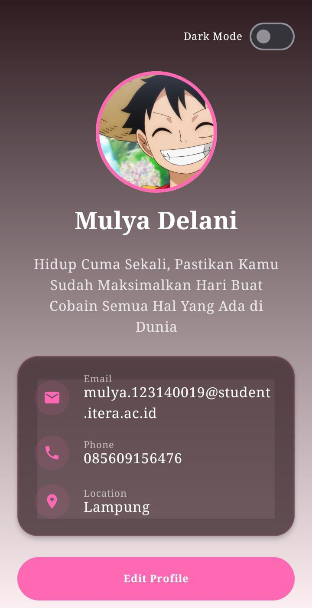
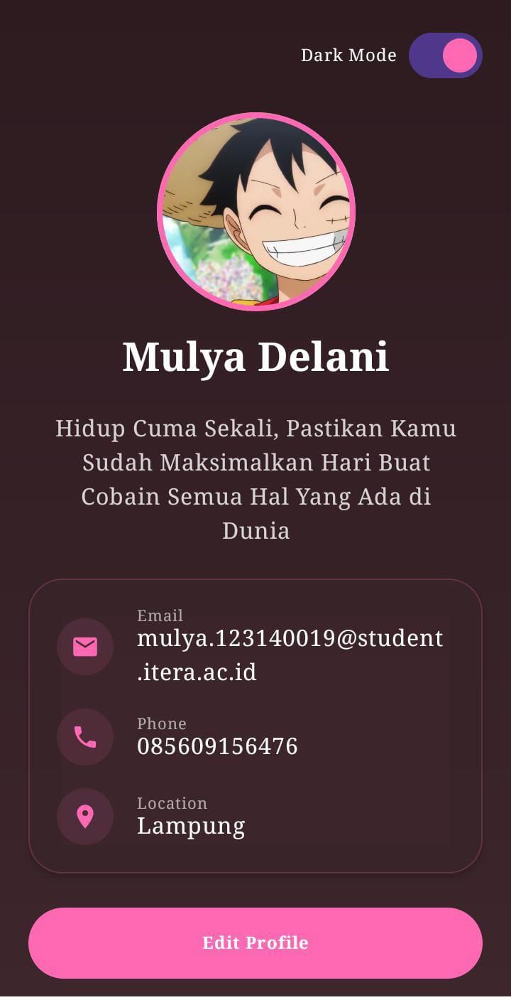
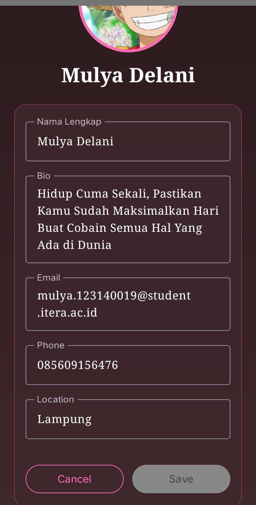

# My Profile App2 🌸

Aplikasi profil Android modern yang dibangun dengan **Jetpack Compose** dan arsitektur **MVVM (Model-View-ViewModel)**. Versi ini menghadirkan estetika yang lembut dengan perpaduan warna Pink, Putih Tulang, dan tipografi klasik.

## ✨ Fitur Unggulan

### 1. **Antarmuka Estetik & Klasik**
- **Tema Warna Khusus**: Menggunakan perpaduan warna *Soft Pink* dan *Bone White* (Putih Tulang) yang memberikan kesan hangat dan bersih.
- **Tipografi Serif**: Menggunakan jenis font *Serif* di seluruh aplikasi untuk memberikan tampilan yang elegan dan profesional layaknya Times New Roman.

### 2. **Sistem Edit Profil Interaktif**
- Perpindahan mulus antara mode tampilan dan mode edit menggunakan `AnimatedContent`.
- **Validasi Cerdas**: Tombol simpan hanya aktif jika data wajib (Nama & Bio) telah diisi dan terdapat perubahan dari data sebelumnya.

### 3. **Desain Modern & Glassmorphism**
- **Latar Belakang Gradasi**: Menggunakan gradasi vertikal yang halus antara warna tema untuk menambah kedalaman visual.
- **Efek Transparansi**: Kartu informasi menggunakan efek semi-transparan (glassmorphism) yang menyatu dengan latar belakang.

### 4. **Mode Gelap (Dark Mode)**
- Dukungan penuh untuk *Dark Mode* dengan transisi warna yang halus menggunakan `animateColorAsState`.

### 5. **Pengalaman Pengguna (UX) yang Responsif**
- **Haptic Feedback**: Memberikan getaran halus saat berinteraksi dengan tombol atau switch untuk sensasi penggunaan yang lebih nyata.
- **Snackbar**: Notifikasi instan yang muncul setelah berhasil memperbarui profil.

---

## 🛠️ Teknologi yang Digunakan

| Komponen | Teknologi |
| --- | --- |
| **Bahasa** | Kotlin |
| **UI Framework** | Jetpack Compose (Material 3) |
| **Arsitektur** | MVVM (Model-View-ViewModel) |
| **Font Family** | Serif (Classic Style) |
| **Animasi** | Compose Animation (`AnimatedContent`, `animate*AsState`) |

---

## 🏗️ Struktur Proyek

- **`data/ProfileUiState.kt`**: Mengelola data profil, status UI, dan logika validasi form.
- **`viewmodel/ProfileViewModel.kt`**: Menangani logika bisnis dan aliran data (StateFlow).
- **`ui/theme/`**: Tempat konfigurasi skema warna pink-putih tulang dan tipografi serif.
- **`MainActivity.kt`**: Implementasi UI utama yang reaktif.

---

## 📸 Tampilan Aplikasi

---

## 🚀 Cara Menjalankan

1. **Clone** repositori ini.
2. Buka di **Android Studio (Ladybug 2024.2.1)** atau yang terbaru.
3. Lakukan **Gradle Sync**.
4. Jalankan pada perangkat Android atau Emulator.

---

**Dibuat oleh:**  
**Mulya Delani** (123140019)
