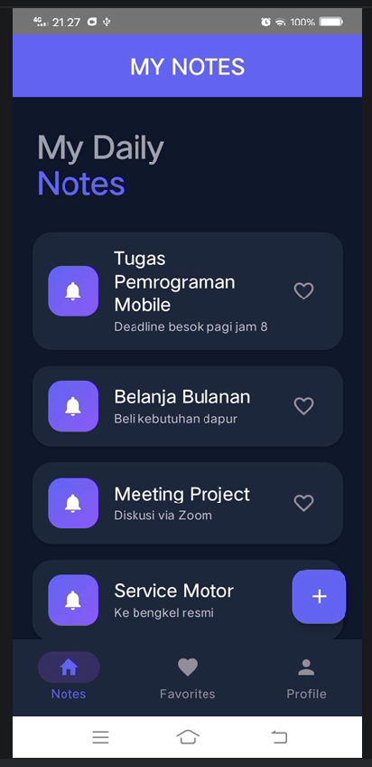
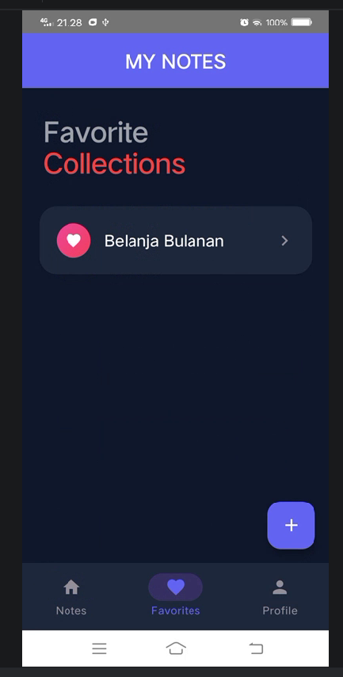
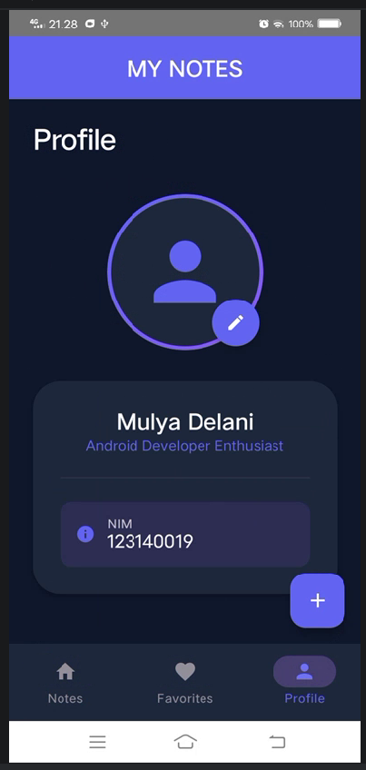

# Notes Pro: Advanced Navigation & UI 📝

Project ini merupakan aplikasi manajemen catatan harian yang dirancang dengan **Jetpack Compose**, mengutamakan estetika visual modern dan sistem navigasi yang robust. Aplikasi ini mengimplementasikan siklus **CRUD** lengkap dengan pengelolaan state yang reaktif dan desain UI premium berbasis **Material 3**.

## video demo
https://github.com/user-attachments/assets/a5cb002a-cf35-49d1-9fc4-abd32dc7bf42

## 📸 Screen Preview
| Home Screen | Favorite Screen | Profile Screen |
|:---:|:---:|:---:|
|  |  |  |

| Detail Note | Add/Edit Note |
|:---:|:---:|
|  |  |

## Fitur Utama & Keunggulan

### 1. Navigasi & Arsitektur Modern
- **Centralized Routes**: Manajemen rute menggunakan `Sealed Class` untuk navigasi yang *type-safe* dan terorganisir.
- **Optimized Bottom Bar**: Navigasi antar layar utama (Notes, Favorites, Profile) dengan retensi state (`saveState`, `restoreState`) untuk pengalaman pengguna yang mulus.
- **Data Passing**: Pengiriman argumen antar layar (seperti `noteId`) menggunakan `navArgument` untuk menampilkan detail data secara dinamis.

### 2. Manajemen Data & State (Full CRUD)
- **Create & Save**: Antarmuka pembuatan catatan baru dengan validasi input dan sistem auto-increment ID.
- **Live Read**: Sinkronisasi data secara *real-time* menggunakan `mutableStateListOf`, memungkinkan pembaruan instan pada list utama dan koleksi favorit.
- **Advanced Edit**: Fitur pembaruan konten catatan yang meliputi Judul, Deskripsi, Isi, hingga waktu Pengingat.
- **Favorite System**: Fitur *bookmark* catatan penting yang terintegrasi di seluruh aplikasi.

### 3. UI/UX Premium (Refined Aesthetics)
- **Modern Color Palette**: Menggunakan skema warna *Indigo* dan *Pink* yang elegan dengan dukungan tema gelap/terang yang kontras.
- **Visual Gradients**: Implementasi `Brush.linearGradient` pada ikon, bingkai profil, dan elemen UI lainnya untuk memberikan kesan kedalaman yang mewah.
- **Dynamic Typography**: Tipografi kustom berbasis *Sans-Serif* dengan skala hierarki yang jelas (Headline Large hingga Label Medium).
- **Soft Card Design**: Penggunaan `ElevatedCard` dengan radius sudut yang lebar (20-28dp) untuk tampilan yang lebih modern dan nyaman di mata.

## Struktur Aplikasi

### 📱 Tampilan Layar
- **Notes Hub**: Layar utama dengan header *Large Title* yang bersih dan daftar catatan dalam format kartu elegan.
- **Detail View**: Tampilan konten mendalam dengan kartu informasi terpisah untuk *Reminder* dan isi catatan.
- **Collections (Favorites)**: Ruang khusus untuk catatan favorit dengan aksen warna merah yang ikonik.
- **Advanced Profile**: Informasi pengguna yang dikemas dalam layout modern, lengkap dengan avatar berbingkai gradasi dan kartu informasi NIM.

## Teknologi yang Digunakan
- **Jetpack Compose**: Framework UI deklaratif utama.
- **Compose Navigation**: Arsitektur navigasi antar layar.
- **Material 3**: Standar desain terbaru dengan komponen UI yang telah dipoles.
- **Material Icons Extended**: Akses ke koleksi ikon yang lebih luas untuk fungsionalitas UI.
- **Kotlin State Flow**: Manajemen data dinamis dan reaktif.

---
**Pengembang:**
- Nahli Saud Ramdani (123140019)
