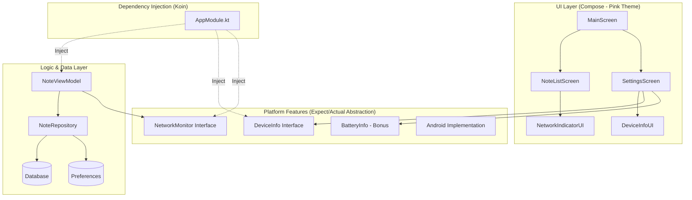
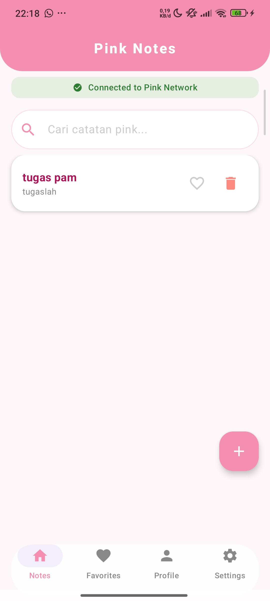
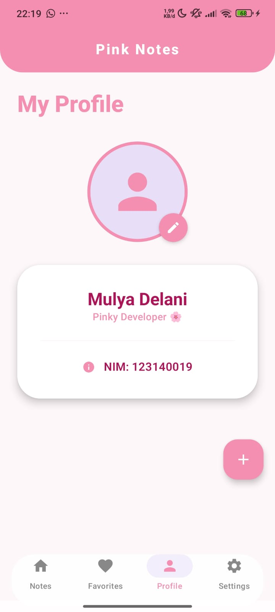
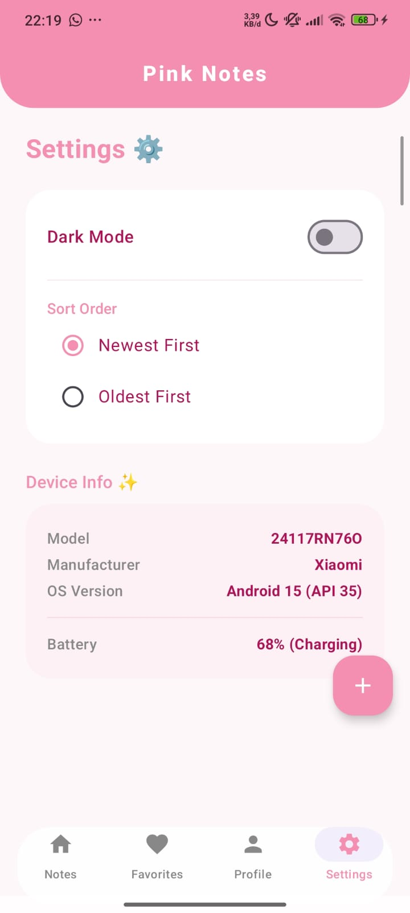
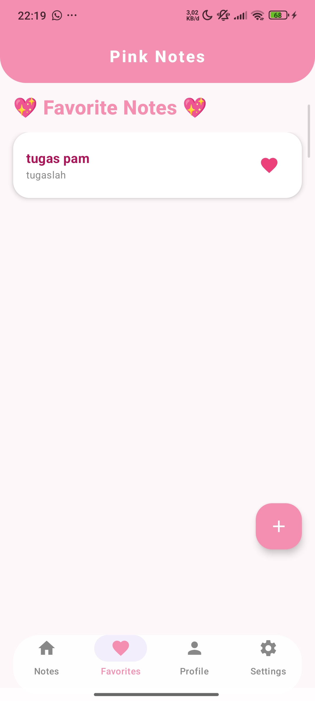

# TUGAS PRAKTIKUM MINGGU 8 - Pink Notes App Upgrade 🌸✨

Aplikasi ini telah di-upgrade dengan tema estetik Pink, fitur platform, dan implementasi **Dependency Injection** menggunakan **Koin**.

---

## 🎨 New Aesthetic UI (Pink Theme)
Aplikasi kini memiliki tampilan khusus "Pink Theme" yang estetik:
- **Floating Bottom Bar**: Navigasi melayang dengan sudut melengkung.
- **Custom Pink Palette**: Perpaduan Soft Pink, Hot Pink, dan Cream.
- **Rounded Aesthetic**: Semua kartu dan input memiliki desain *rounded* yang modern.

---

## 🏗️ Architecture Diagram

Project ini mengadopsi struktur modular dengan pemisahan tanggung jawab yang jelas:

---

## 📝 Fitur Utama & Deskripsi Tugas

1.  **Koin DI Setup**: Implementasi penuh Koin untuk menyuntikkan (inject) Repository, ViewModel, dan Platform Services secara otomatis.
2.  **DeviceInfo (expect/actual pattern)**: Abstraksi untuk mengambil informasi hardware (Model, Manufacturer, OS).
3.  **NetworkMonitor (expect/actual pattern)**: Memantau konektivitas secara reaktif menggunakan `callbackFlow` dan ditampilkan di UI secara real-time.
4.  **Aesthetic Settings Screen**: Menampilkan informasi sistem dan pengaturan aplikasi dalam desain kartu estetik.
5.  **Reactive Network UI**: Bar indikator "Connected to Pink Network" yang berubah warna sesuai status internet.
6.  **Full Injection**: Seluruh komponen dikelola dalam `appModule`.

---

## ✅ Rubrik Penilaian

| Komponen | Bobot | Status |
| :--- | :---: | :--- |
| **Koin DI Setup** | 25% | Terimplementasi (AppModule & NotesApplication) |
| **expect/actual Pattern** | 25% | Terimplementasi (Pola Interface & Implementasi Platform) |
| **Aesthetic UI Integration** | 20% | Terimplementasi (Home, Settings, Profile with Pink Theme) |
| **Architecture** | 20% | Clean separation & modular package structure |
| **Code Quality** | 10% | Clean code, Comments, & Documentation |
| **Bonus ⭐** | +10% | **BatteryInfo implementation (Level & Status)** |

---

## 📱 Screenshots

| Home | Profile | Settings |
| :---: | :---: | :---: |
|  |  |  |

| Dark Mode | Detail Note |
| :---: | :---: |
|  |  |

| Edit Note | Favorites |
| :---: | :---: |
|  |  |

---

## 📸 Identitas Mahasiswa
- **Nama**: Mulya Delani
- **NIM**: 123140019

---
*Pengembangan Aplikasi Mobile*
