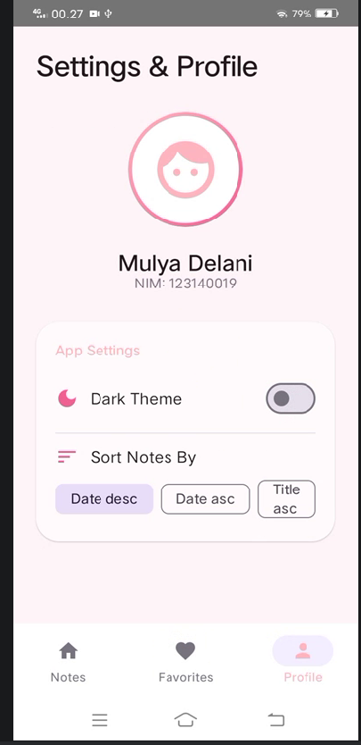

# 🌸 Pink Notes Pro: Advanced SQLDelight & DataStore 📝

Update tugas minggu 7: Aplikasi catatan harian dengan fitur lengkap, database lokal, dan desain estetik bertema Pink.

## 📺 Video Demo


https://github.com/user-attachments/assets/608e8653-b94f-4303-88f9-104924b2b5fd


## 📸 Screen Preview Minggu 7

| Home Screen | Favorite Screen | Profile Screen |
|:---:|:---:|:---:|
|  |  |  |

|              Detail Note              |
|:-------------------------------------:|
|  |

## 🛠️ Fitur Baru (Update Minggu 7)

### 1. 🗄️ SQLDelight Database (Offline-First)
- **Schema**: Tabel `NoteEntity` untuk menyimpan `title`, `description`, `content`, `reminder`, `isFavorite`, dan `createdAt`.
- **CRUD Operations**: Implementasi lengkap Create, Read, Update, dan Delete yang tersimpan permanen di memori lokal.
- **Reactive Queries**: Menggunakan Flow untuk pembaruan UI otomatis saat data di database berubah.
- **Type Safety**: Penggunaan custom `ColumnAdapter` untuk pemetaan tipe data Boolean di SQLite.

### 2. ⚙️ Jetpack DataStore Settings
- **Theme Persistence**: Menyimpan pilihan Dark Mode/Light Mode secara permanen menggunakan `booleanPreferencesKey`.
- **Sort Order**: Menyimpan preferensi pengurutan catatan (berdasarkan Tanggal Terbaru, Terlama, atau Judul) menggunakan `stringPreferencesKey`.

### 3. 🔍 Search Functionality
- Fitur pencarian real-time yang memfilter judul dan isi catatan langsung dari database menggunakan query `LIKE`.

### 4. 🎀 Aesthetic UI/UX
- **Pink Theme**: Skema warna kustom bertema merah muda/pastel yang estetik (`PrimaryPink`, `SecondaryPink`, `GradientPink`).
- **UI States**: Implementasi state *Loading*, *Empty*, dan *Success* yang responsif.
- **Material 3**: Penggunaan komponen terbaru seperti `ElevatedCard`, `FilterChip`, dan `NavigationSuiteScaffold`.

## 🏗️ Database Schema (`NoteEntity.sq`)
```sql
CREATE TABLE NoteEntity (
    id INTEGER PRIMARY KEY AUTOINCREMENT,
    title TEXT NOT NULL,
    description TEXT NOT NULL,
    content TEXT NOT NULL,
    reminder TEXT NOT NULL,
    isFavorite INTEGER AS kotlin.Boolean NOT NULL DEFAULT 0,
    createdAt INTEGER NOT NULL
);
```

## 🚀 Teknologi yang Digunakan
- **Java 21 & Kotlin 2.0.21**: Menggunakan JVM Toolchain terbaru.
- **SQLDelight 2.0.2**: SQL persistence yang *type-safe* untuk Kotlin Multiplatform/Android.
- **Jetpack DataStore 1.1.1**: Solusi penyimpanan data preferensi modern.
- **Jetpack Compose**: Framework UI deklaratif dengan Material 3.
- **ViewModel & Flow**: Manajemen state dan aliran data reaktif.

---
**Dikerjakan oleh:**
- Mulya Delani (123140019)
- Pengembangan Aplikasi Mobile - ITERA
