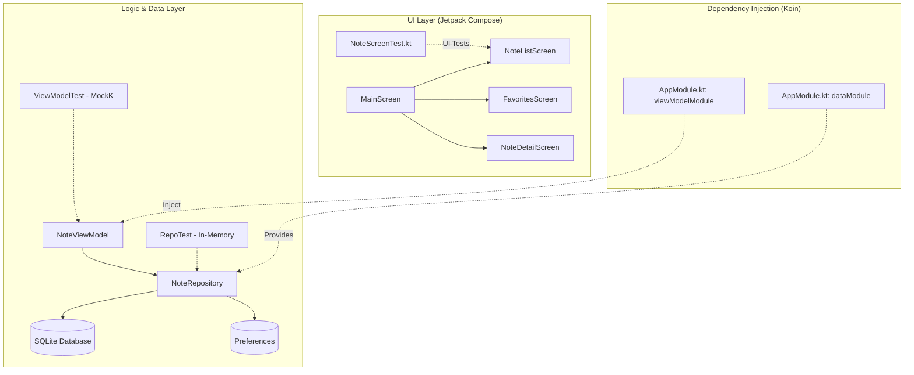
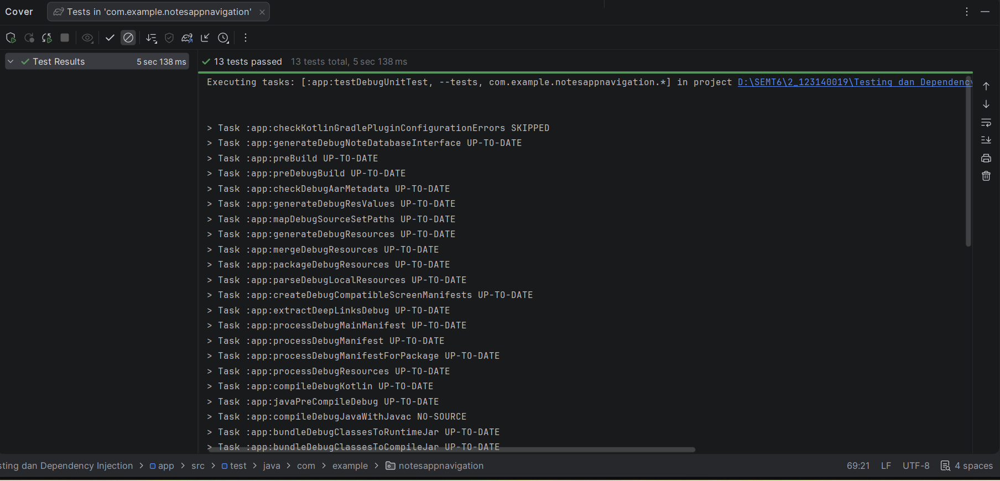

#NotesAppNavigation - Tugas Praktikum Minggu 10 📝🧪

Aplikasi **PinkNotes** adalah aplikasi manajemen catatan berbasis Android yang mengimplementasikan standar arsitektur modern dengan **Dependency Injection**, **Reactive Programming**, dan **Automated Testing**.

---

## 🏗️ Architecture & Tech Stack

Project ini menggunakan pemisahan tanggung jawab yang jelas untuk meningkatkan skalabilitas dan kemudahan pengujian:

---

## 📝 Deskripsi Tugas & Fitur

1.  **Koin Dependency Injection**: Implementasi `AppModule.kt` untuk mengelola instansi Singleton (Repository, Database) dan ViewModel secara otomatis, mengurangi *boilerplate code*.
2.  **SQLDelight Persistence**: Menggunakan SQLDelight untuk manajemen database yang *type-safe* dan reaktif (menggunakan Flow untuk memantau perubahan data).
3.  **Unit Testing (Logic)**: 
    - **ViewModel Test**: Menguji logika pencarian, penghapusan, dan pembaruan status favorit menggunakan **MockK**.
    - **Repository Test**: Memastikan query SQL bekerja dengan benar menggunakan **In-Memory SQLite Driver**.
4.  **UI Testing (Compose)**: Pengujian otomatis pada `NoteScreenTest.kt` menggunakan `createComposeRule()` untuk memverifikasi komponen UI seperti list catatan dan *empty state*.
5.  **Platform Integration**: Penambahan fitur `DeviceInfo`, `BatteryInfo`, dan `NetworkMonitor` yang di-inject via Koin untuk memantau status perangkat secara *real-time*.
6.  **Code Coverage**: Verifikasi kualitas pengujian melalui fitur *Run with Coverage* di Android Studio.

---

## 📸 Dokumentasi Pengujian

| Unit Test & Repository Test | Code Coverage Report |
| :---: | :---: |
|  |  |

---

## 🎥 Video Demo
https://github.com/user-attachments/assets/7a6ea3ec-438a-49ea-8451-8968f98c69d7

---
**Identitas Mahasiswa:**
- **Nama**: Mulya Delani
- **NIM**: 123140019
- **Kelas**: Pengembangan Aplikasi Mobile (PAM)

---
*Dibuat untuk memenuhi tugas Praktikum Minggu 10 - Testing & DI*
